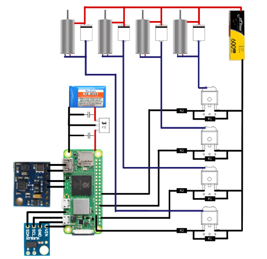
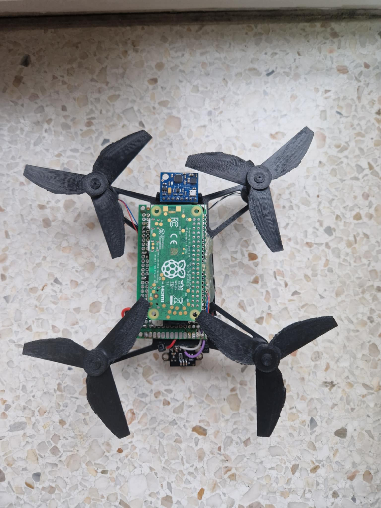
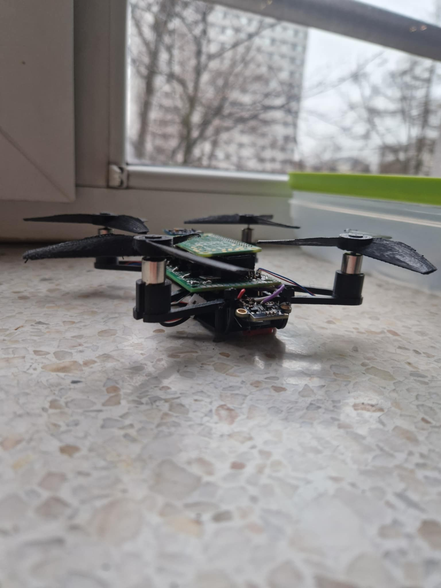

# Micro Drone Project

## Overview
This project focuses on developing a lightweight micro-drone controlled by a Raspberry Pi Zero 2 W. The drone features a durable 3D-printed frame, fast brushed DC motors, and a robust control system utilizing Python-based software and wireless communication via WiFi. The design prioritizes cost-efficiency, simplicity, and functionality.

---

## Features
### Hardware
- **Motors**: 4 x brushed 8520 motors (2 CW, 2 CCW), max current draw: 1.5A per motor.
- **Power Supplies**:
  - **For Motors**: Tattu 1S 3.7V 600mAh 30C LiPo battery.
  - **For Raspberry Pi**: Nine Eagles 2S 7.4V 250mAh LiPo battery with an LD1117 voltage regulator (5V output).
- **Electronics**:
  - 4 x SUD50N025-06P logic-level MOSFETs for motor control.
  - 4 x SS24 diodes for protection.
  - Resistors: 4 x 10k (control), 4 x 1k (pull-down).
- **Frame**: 3D-printed with a 130mm layout, total weight: 80g.
- **Propellers**: 3D-printed, 4-inch diameter.
- **Sensors**:
  - MPU6050 (accelerometer + gyroscope).
  - Ultrasonic distance sensor for safe landing.
  

### Software
- **Languages**: Python
- **Key Modules**:
- `client.py`: Sends control commands to the drone via WiFi, handles keyboard inputs.
- `server.py`: Receives commands on the Raspberry Pi and routes them to motor controllers.
- `dane.py`: Reads sensor data collectively (e.g., from the accelerometer, gyroscope, or other modules).
- `kontrola.py`: Monitors the drone’s tilt and activates the appropriate motors to correct orientation.
- `akce_zyro.py`: Handles direct readings from the accelerometer and gyroscope to support flight stabilization.

---

## Technical Specifications
### Power Calculation
- **Battery**: 600mAh, 3.7V, 30C (18A max discharge).
- **Estimated ON Time**:
 ```
ON time = ~3 min
```
- **Drone Weight**: 107g, with sufficient thrust for stable flight using 4 motors.

### Motor Speed Control
- **PWM (Pulse Width Modulation)**: 
- The Raspberry Pi Zero 2 W generates PWM signals for each motor.
- Logic-level MOSFETs (SUD50N025-06P) modulate the current to the motors, controlling their speed.
- The duty cycle of the PWM signal determines the average voltage supplied to the motors.

---

## Connection schematic
View of connections below:

<p align="center">
  
</p>

| Component                  | Raspberry Pi Pin |
|----------------------------|------------------|
| Motor 1 (CW)               | GPIO23 (Pin 16)  |
| Motor 2 (CCW)              | GPIO24 (Pin 18)  |
| Motor 3 (CW)               | GPIO12 (Pin 32)  |
| Motor 4 (CCW)              | GPIO13 (Pin 33)  |
| MPU6050 SDA                | GPIO2 (Pin 3)    |
| MPU6050 SCL                | GPIO3 (Pin 5)    |
| Ultrasonic Sensor TRIG     | GPIO2 (Pin 3)    |
| Ultrasonic Sensor ECHO     | GPIO3 (Pin 5)    |
| Power to Motors (+)        | Pin 4 (5V)       |
| Power to Motors (-)        | Pin 6 (GND)      |
| Power to MPU6050 (+)       | Pin 1 (3.3V)     |
| Power to MPU6050 (-)       | Pin 9 (GND)      |

---

## Testing
### Speed Control Tests
1. **Voltage Measurement**:
 - Verified voltage on motors at different PWM duty cycles using a digital multimeter.
 - Confirmed linear relation between PWM duty cycle and motor voltage.
2. **Motor Uniformity**:
 - Tested all motors individually to check speed consistency.
 - Observed variation within 3%, ensuring balanced performance.
3. **Load Testing**:
 - Measured current draw and voltage under load conditions with propellers attached.

### Power System Tests
- **Regulator Stability**:
- Verified stable 5V output from the LD1117 regulator under Raspberry Pi and sensor load.
- **Battery Performance**:
- Observed slight voltage drop (3.7V to ~3.4V) during maximum motor load, consistent with LiPo behavior.

---

## How to Run the Project
1. Clone the repository:
 ```bash
 git clone https://github.com/your-repo/micro-drone.git
 cd micro-drone
```
2. Assemble the Drone

- Connect all components on the breadboard as shown on the display/schematic.
- Mount everything onto the 3D-printed frame.
- Attach the propellers to the motors.
- Ensure the LiPo batteries are connected correctly (one for motors, one regulated for the Raspberry Pi).
- Power the Raspberry Pi and Sensors
- Use the 2S LiPo battery with the LD1117 regulator to supply 5V to the Pi.
- Connect the 1S LiPo battery to power the motors.
  <p align="center">  </p>
  <p align="center">  </p>
  
3. Power the Raspberry Pi and sensors using the LiPo battery.
4. Start the server on the Raspberry Pi
   ```bash
   python3 server.py
   ```
5. Launch the client application on your laptop:
   ```bash
   python3 client.py
   ```
6. Use the GUI or keyboard to control the drone.
7.If needed, run or import:

    dane.py for sensor data reading.
    kontrola.py for tilt management and motor corrections.
    akce_zyro.py for direct accelerometer and gyroscope handling.
 
### Future Work

- Optimize power efficiency to extend flight time.
- Add a camera module for real-time video streaming.
- Improve flight stabilization with advanced PID control.

## Contributors

- Arkadiusz Kowalczyk
- Krystian Bajerski

Project supervised by **PhD Agnieszka Dąbrowska-Boruch**
